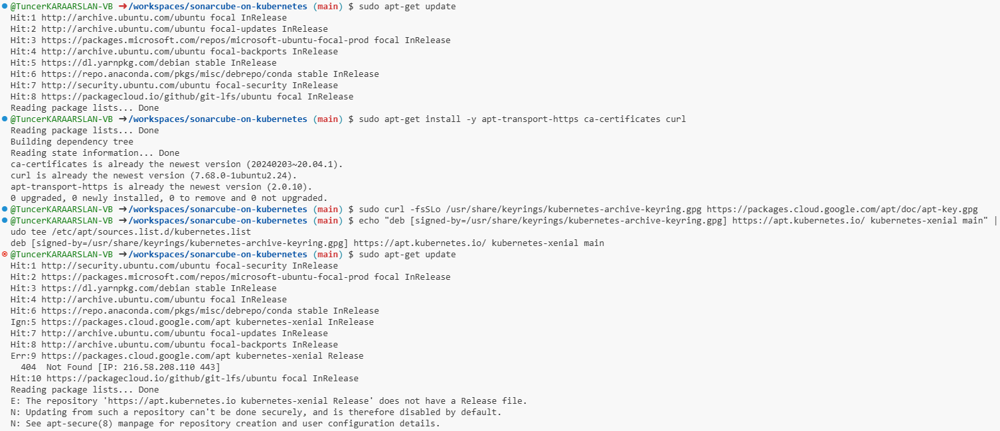

To resolve the issue where the package manager is unable to locate `kubectl`, you need to manually add the official Kubernetes repository to your system and update the package list. Here’s how you can solve it:

### Steps to Install `kubectl` When "Unable to Locate Package" Error Occurs:

#### 1. **Add the Kubernetes Package Repository**

First, ensure that the necessary transport and certificate tools are installed:

```bash
sudo apt-get update
sudo apt-get install -y apt-transport-https ca-certificates curl
```

Next, add the Kubernetes package signing key to your system:

```bash
sudo curl -fsSLo /usr/share/keyrings/kubernetes-archive-keyring.gpg https://packages.cloud.google.com/apt/doc/apt-key.gpg
```

Then, add the Kubernetes package repository to your sources list:

```bash
echo "deb [signed-by=/usr/share/keyrings/kubernetes-archive-keyring.gpg] https://apt.kubernetes.io/ kubernetes-xenial main" | sudo tee /etc/apt/sources.list.d/kubernetes.list
```

#### 2. **Update the Package List**

After adding the Kubernetes repository, update your system’s package list:

```bash
sudo apt-get update
```

#### 3. **Install `kubectl`**

Now you should be able to install `kubectl` without encountering the error:

```bash
sudo apt-get install -y kubectl
```

#### 4. **Verify the Installation**

Once installed, check if `kubectl` is working by verifying the version:

```bash
kubectl version --client
```

### Additional Troubleshooting:
- **Check System Architecture:** Ensure you're using the correct repository for your system's architecture.
- **Check Network Connectivity:** Make sure your network connection is stable, and your Codespace or environment has access to the internet.

This should resolve the "Unable to locate package `kubectl`" issue and install `kubectl` successfully.



