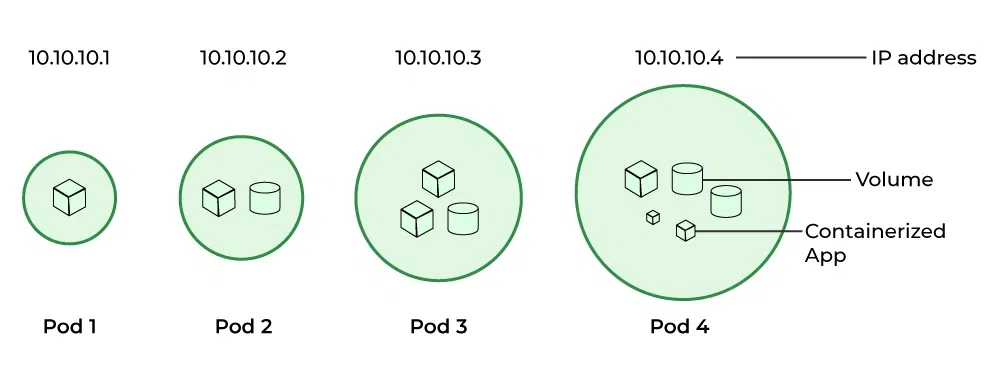
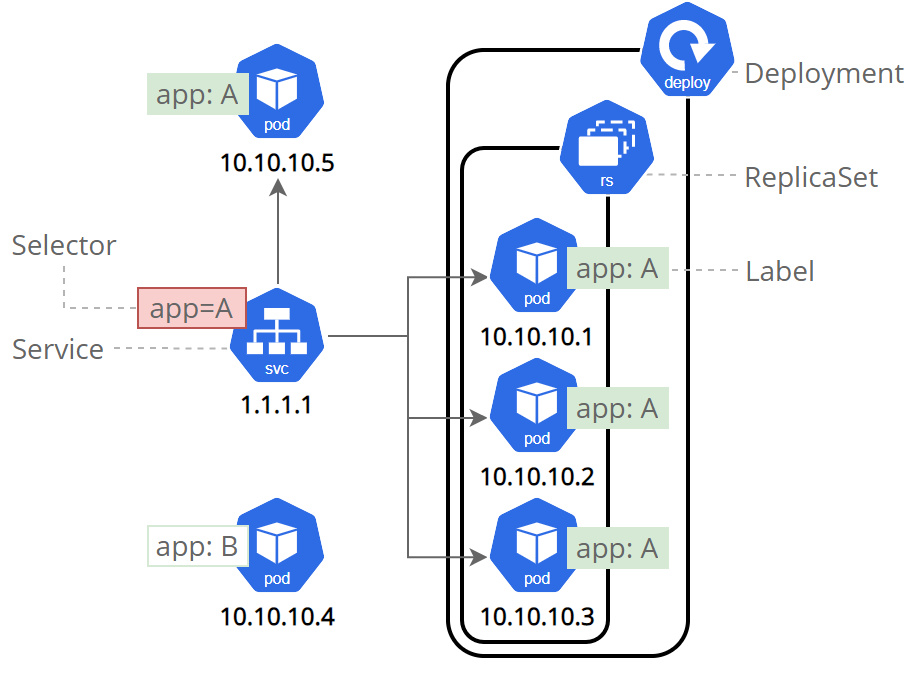

### prompt
***What is a pod? > Explain step by step from easy to difficult so that I understand the subject correctly.***

A **Pod** is the basic unit in Kubernetes that runs your application’s code. To help you understand what a Pod is, let's break it down step by step from simple to more advanced concepts.

### 1. **Pod: The Smallest Unit in Kubernetes**
   - A **Pod** is the smallest deployable object in Kubernetes. Think of it as a wrapper around your application’s container(s).
   - In the simplest terms, a Pod runs one or more **containers** (e.g., Docker containers) that contain your application.

### 2. **Pod vs. Container**
   - Containers are lightweight, isolated environments where your application runs. 
   - A **Pod** in Kubernetes usually contains **one container**, but it can also contain multiple containers that work together.
     - **Single-container Pods** are the most common.
     - **Multi-container Pods**: Multiple containers are grouped together and can share resources (like storage) and networking.

     

### 3. **Why Use Pods Instead of Just Containers?**
   - While containers provide isolation, Pods in Kubernetes help with orchestration (management and scaling).
   - Kubernetes uses Pods to manage groups of containers, ensuring they can scale, restart, and maintain the desired state automatically.

### 4. **How Pods Work**
   - Each Pod gets its own unique **IP address**.
   - Pods share a network namespace, meaning all containers in a Pod can communicate with each other directly using `localhost`.
   - Pods can also **share storage volumes**, making it easy for containers within a Pod to share files.

### 5. **Pod Lifecycle**
   - Pods have a **lifecycle**: from being scheduled, running, and potentially terminating.
     - **Pending**: Pod has been created but is waiting for a Node to run on.
     - **Running**: The Pod has been scheduled on a Node, and its containers are running.
     - **Succeeded**: The Pod has completed successfully.
     - **Failed**: The Pod encountered an error and failed.
     - **Terminating**: The Pod is shutting down.

### 6. **Pods are Ephemeral**
   - **Pods are not designed to be permanent**. If a Pod dies, it won’t automatically restart. Instead, Kubernetes creates a new Pod if needed (often through a **controller** like a **Deployment**).
   - Pods are disposable and short-lived in nature. They are often replaced, rather than repaired, when issues occur.

### 7. **Pod Networking and IP Address**
   - Each Pod has its own unique **IP address** within the cluster.
   - **All containers** inside a Pod share the same network stack. This means they can talk to each other using `localhost` but need services to communicate outside the Pod.

### 8. **Multi-Container Pods**
   - While most Pods contain only a single container, sometimes you have **multi-container Pods**.
     - These containers are tightly coupled and need to share resources like files and data.
     - They run on the same Node and work together as a single unit.

### 9. **Pod Usage in Kubernetes**
   - When you deploy an application in Kubernetes, it’s actually creating a Pod behind the scenes to run your container(s).
   - Kubernetes uses **Controllers** (like **Deployments**, **ReplicaSets**, and **StatefulSets**) to manage the lifecycle of Pods. These controllers ensure that the correct number of Pods are running, and if any Pod fails, they create new ones to replace them.

   

### 10. **Advanced Pod Concepts**
   - **Init Containers**: These are special containers that run before your main container in the Pod starts. They are used to prepare the environment (e.g., checking if dependencies are available).
   - **Sidecar Containers**: In multi-container Pods, a sidecar is a container that runs alongside the main application, providing additional functionality (e.g., logging, proxy).
   - **Ephemeral Containers**: These are temporary containers that help debug a running Pod.

### Summary:
- A **Pod** is the smallest unit of work in Kubernetes that can run one or more containers.
- Pods allow Kubernetes to manage containers effectively, ensuring they can scale, restart, and maintain the desired state.
- Pods are ephemeral, meaning they can be replaced easily if they fail.
- While most Pods contain a single container, Pods can have multiple containers that share resources and networking.
